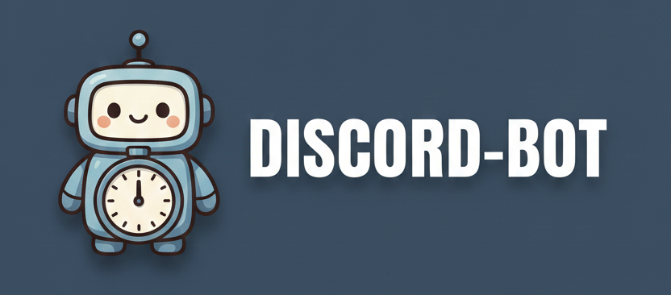

<center></center>

# 🕒 우아한테크코스 오픈 미션


> **ChronoBot**은 **Discord API(JDA)** 기반으로 구축된 **온라인 스터디 카페 시스템 지원 봇**입니다.<br>
> 포인트로 이용시간을 충전해 개인 공부방에서 공부 시간을 자동 기록할 수 있으며,<br>
> 이벤트 기간 동안의 누적 이용시간을 기준으로 랭킹·보상 시스템까지 제공하는 통합 학습 관리 플랫폼입니다.

---

## 📌 목차
* [기능 목록](#기능-목록)
* [실행 방법](#실행-방법)
* [배포 환경](#배포-환경)
* [사용자 가이드](#사용자-가이드)
---

## 💻 기술 스택


---

## ⚙️ 주요-기능-목록 (Core Features)

- **포인트 시스템**: 학습 활동으로 포인트 획득 및 이용시간 구매
- **이용시간 관리**: 포인트로 충전한 이용시간으로 타이머 실행 가능
- **개인 공부방**: 개인 전용 텍스트 채널 생성 및 학습 시간 기록
- **타이머 기능**: 공부 시작/종료 시 자동 기록
- **이벤트 관리**: 이벤트 생성, 참여, 기간 내 누적 이용시간 기반 랭킹 산정
- **보상 시스템**: 이벤트 상위권에게 포인트/상품 지급
- **확장 예정**: 포인트 기반 기프티콘 상점, 주간/월간 리더보드 등

---

## ▶️ 실행-방법 (How to Run)

1. **환경 변수 설정 (.env 또는 application.yml)**
    ```text
    DISCORD_TOKEN=your_discord_bot_token
    DB_URL=your_database_url
    DB_USER=your_database_user
    DB_PASSWORD=your_database_password
    ```
2. **의존성 설치 및 빌드**
    ```bash
    ./gradlew clean build
    ```
    - Windows: `gradlew.bat clean build`

3. **애플리케이션 실행**
    ```bash
    ./gradlew bootRun
    ```
    - Windows: `gradlew.bat bootRun`

---

## ☁️ 배포-환경 (Deployment environment)

- **AWS**: RDS(MySQL) 사용, EC2 혹은 컨테이너 기반 배포 가능
- **JVM**: Java 21
- **Spring Boot**: WebSocket/JDA 연동으로 디스코드 봇 실행

---

## 📘 사용자 가이드 (User Guide)

### 🛠️ 관리자 등록 (setup)

<details>
<summary><strong>서버 최초 관리자 등록 방법</strong></summary>

#### 1. `setup` 명령어 실행
서버 최초 1회, 아래 명령어 입력을 통해 **관리자 계정을 등록**합니다.


#### 2. 실행 결과 예시
성공적으로 등록되면 아래와 같은 메시지가 출력됩니다.


---

#### ⚠️ 왜 setup 명령어가 필요한가?

- 처음 DB에는 **관리자 정보가 저장되어 있지 않음**
- 따라서 봇은 **어느 사용자가 관리자 역할인지 식별할 수 없음**
- 그 결과  
  → 관리자 전용 명령어들이 모두 **차단됨**  
  (예: `/points admin`, `/times admin`, 기타 관리 기능)

이를 해결하기 위해 **최초에 setup 명령어를 반드시 1회 실행**해야 합니다.

---

#### 🔒 실행 조건

| 조건 | 설명 |
|------|------|
| 관리자 수 = 0 | DB에 관리자가 1명이라도 존재하면 `setup` 명령어는 **실행 불가** |
| 최초 서버 설정 단계 | 디스코드 서버 생성 후 **첫 설정 과정에서만 실행 가능** |

즉, **서버 최초 1회만 유효**한 명령어입니다.
</details>

---

## 🛠️ 트러블 슈팅 (Trouble Shooting)

<details>
<summary>⚡ Slash Command 3초 응답 제한 초과 오류 (Timeout Error)</summary>

### ❗ 문제 현상 (Symptom)
데이터베이스 조회, 복잡한 계산 등 **처리 시간이 3초를 초과**하는 작업 수행 시, 최종 응답(reply)에서 아래와 같은 오류가 발생합니다.

`java.lang.IllegalStateException: Interaction has already been acknowledged`

---

### 🔍 원인 (Cause)
Discord API는 슬래시 커맨드(`Slash Command`)와 같은 **모든 상호작용(Interaction)** 발생 시, **최대 3초 이내에 봇이 응답했다는 것을 반드시 알려야**(`Acknowledge`, ACK) 합니다.

* **ACK 실패:** 3초 안에 응답하지 않으면 디스코드는 해당 Interaction을 **'만료됨(Expired)'** 상태로 간주하고, 최종 응답을 위한 `event.reply()` 호출 시 **"이미 응답되었거나 만료된 상호작용"**이라는 오류가 발생합니다.

### ✅ 해결 방법 (Solution)

작업에 시간이 걸리는 경우, **실제 작업 실행 전에 먼저 디스코드에 응답을 미룬다는 ACK**를 보냅니다. 이후 최종 응답은 **웹훅(Webhook)**을 통해 안전하게 처리합니다.

#### 1. `deferReply()`로 즉시 응답 ACK 처리

시간이 걸리는 로직을 실행하기 **직전에** `deferReply()`를 호출하여 디스코드에게 **"응답 처리 중입니다. 잠시 기다려주세요."**라는 상태를 즉시 알립니다.

```java
event.deferReply(true).queue(); // 즉시 ACK 처리.
```

### 2. getHook().sendMessage()로 안전하게 최종 응답
오래 걸리는 작업이 완료된 후, event.getHook()을 사용하여 응답 웹훅을 통해 최종 메시지를 보냅니다. 웹훅을 사용하면 3초 제한을 우회하여 최대 15분 이내에 안전하게 응답할 수 있습니다.

```java
Member member = memberService.findMember(userId); // 시간이 오래 걸리는 DB 조회/로직

// getHook()을 사용하여 웹훅 채널로 최종 메시지를 전송
event.getHook().sendMessage(member.getPoint() + " 포인트 보유").queue();
```

> ⭐ 핵심 요약: deferReply()로 3초 제한을 회피하고, event.getHook()으로 reply 중복 호출 문제를 동시에 해결합니다.
</details>